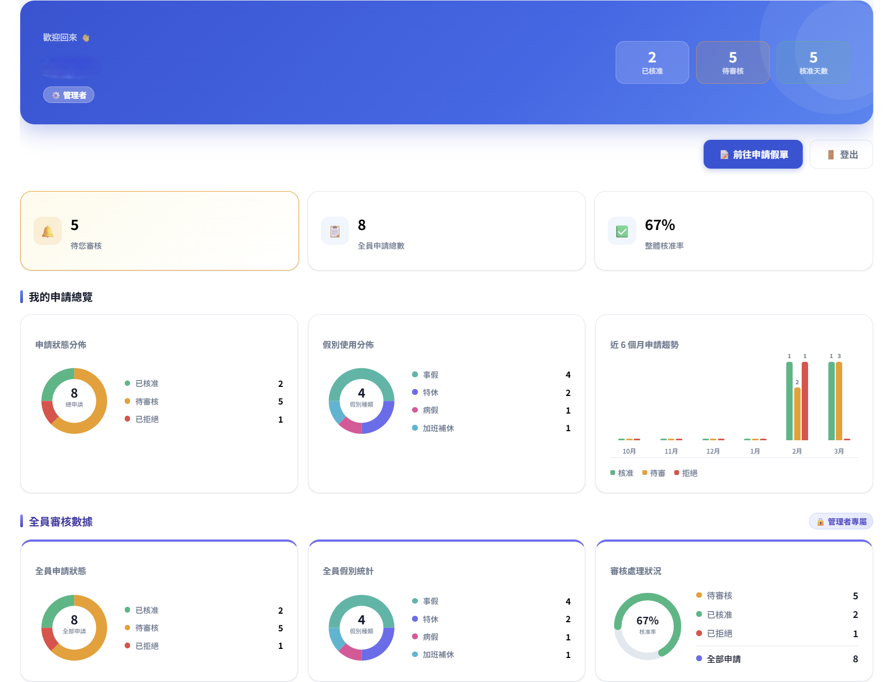

# 醫院出勤申請管理系統 — Angular + TypeScript 重構版

> 🔁 **系列說明｜三版本技術演進**
>
> | 版本 | Repo | 核心目標 |
> |------|------|----------|
> | v1 | `attendance-system` | 後端架構設計、業務邏輯實作 |
> | v2 | `attendance-system-vue` | 前端元件化工程實踐（Vue 3 + Vite） |
> | v3 ｜**你在這裡** | `attendance-system-ts` | 企業級前端重構（Angular 17+ + TypeScript） |
>

---

Vue 3 版缺乏型別約束與嚴謹的非同步資料流管理。本版以 Angular 17+ 重構，導入 TypeScript interface 在開發階段捕捉型別錯誤、HttpInterceptor 取代手動 token 管理、RxJS 解決多條件篩選的時序協調問題。

🌐 **線上 Demo** → [點此開啟系統](https://ktl541529-lang.github.io/attendance-system-ts/)

| 層級 | 服務 |
|------|------|
| 前端 | GitHub Pages（Angular 17+） |
| 後端 | Render（Node.js）— 與 v1 共用 |
| 資料庫 | Railway（MySQL）— 與 v1 共用 |

**示範帳號**

| 帳號 | 密碼 | 角色 |
|------|------|------|
| admin | 1234 | 管理者 |
| emp1 | 1234 | 一般員工 |

---

## 📸 系統截圖

### 管理者儀表板

管理者可即時掌握全員審核狀態、假別分佈與近 6 個月申請趨勢；下方「全員審核數據」區塊僅管理者可見，一般員工登入後只看到個人統計。



> 角色分離設計：儀表板的資料來源與顯示區塊依角色動態切換，非單純隱藏 DOM 元素。

---

## 🎯 重構動機：從 Vue 到 Angular，解決什麼問題？

v2（Vue 3）建立了元件化基礎，但隨著功能複雜度提升，幾個工程問題變得明顯：

| 問題 | Vue 3 版本的狀況 | Angular 重構的解法 |
|------|----------------|-------------------|
| 型別安全 | JavaScript，runtime 才發現型別錯誤 | TypeScript interface + union type，IDE 開發階段即提示 |
| HTTP 管理 | Fetch 模組手動帶 token | HttpInterceptor 自動注入，401 處理集中 |
| 複雜資料流 | 多條件篩選需手動協調時序 | RxJS combineLatest + switchMap，資料流宣告式組合 |
| 路由保護 | `beforeEach` 命令式判斷 | `CanActivateFn` 宣告式守衛，Lazy Loading 按需載入 |
| 假日感知 | 無 | 串接政府開放資料 API，表單即時提示 |

---

## 🔑 技術亮點

### 1. HttpInterceptor — 統一 Token 管理

所有 HTTP Request 自動附加 `Authorization: Bearer <token>`，無需每個 API call 手動處理。同時攔截 401 回應，自動清除 token 並導回登入頁，與後端 `auth.js` middleware 形成前後端對稱的安全防護。

```typescript
// core/interceptors/auth.interceptor.ts
export const authInterceptor: HttpInterceptorFn = (req, next) => {
  const token = inject(AuthService).getToken();
  const authReq = token
    ? req.clone({ setHeaders: { Authorization: `Bearer ${token}` } })
    : req;

  return next(authReq).pipe(
    catchError((err) => {
      if (err.status === 401) inject(AuthService).logout();
      return throwError(() => err);
    })
  );
};
```

### 2. TypeScript 型別設計

以 `interface` 定義所有資料模型，用 `union type` 限制狀態與假別欄位的合法值。後端 API 回傳的資料結構在前端有對應的型別約束，IDE 可在開發階段即時提示錯誤，避免 runtime 的型別問題。

```typescript
// models/attendance.model.ts
export type AttendanceStatus = 'pending' | 'approved' | 'rejected';
export type AttendanceType = '特休' | '病假' | '事假' | '婚假' | '喪假' | '加班補休';

export interface AttendanceRequest {
  id: number;
  user_id: number;
  type: AttendanceType;
  status: AttendanceStatus;
  start_date: string;
  end_date: string;
  reason: string;
  reject_reason?: string;
}
```

### 3. RxJS 響應式篩選資料流

出勤列表的多條件篩選（狀態、假別、關鍵字）以響應式方式組合，解決手動協調非同步時序的問題：

```typescript
this.filteredRequests$ = combineLatest([
  this.statusFilter.valueChanges.pipe(startWith('')),
  this.typeFilter.valueChanges.pipe(startWith('')),
  this.keywordFilter.valueChanges.pipe(startWith(''), debounceTime(300)),
]).pipe(
  switchMap(([status, type, keyword]) =>
    this.attendanceService.getRequests({ status, type, keyword })
  ),
  takeUntil(this.destroy$)   // 元件銷毀時自動取消訂閱，防止 memory leak
);
```

- `combineLatest`：任一篩選條件改變即觸發
- `debounceTime(300)`：關鍵字輸入防抖，避免每次按鍵都發送請求
- `switchMap`：只保留最後一次請求結果，自動取消過時的請求
- `takeUntil`：元件銷毀時自動清理訂閱

### 4. AuthGuard 路由保護 + Lazy Loading

```typescript
// core/guards/auth.guard.ts
export const authGuard: CanActivateFn = (route) => {
  const auth = inject(AuthService);
  const router = inject(Router);
  if (!auth.isLoggedIn()) return router.createUrlTree(['/login']);
  if (route.data['adminOnly'] && !auth.isAdmin()) return router.createUrlTree(['/dashboard']);
  return true;
};
```

搭配 Lazy Loading，各頁面模組按需載入，初始化包體積最小化。

### 5. 角色分離儀表板

儀表板依登入角色動態切換資料來源與顯示內容：

- **管理者**：全員申請狀態、假別分佈、近 6 個月趨勢、待審核件數提醒
- **一般員工**：僅顯示個人統計，不可存取全員資料

角色判斷在 Service 層與 component 的 template 同時進行，非單純 `*ngIf` 隱藏 DOM，確保管理者專屬 API 不會被員工觸發。

### 6. 政府假日 API 串接

串接政府開放資料假日 API，申請表單日期欄位選到假日或週末時即時顯示警告。HolidayService 實作本地快取，同一次 session 內不重複請求相同年份資料。

---

## 🛠 技術棧

| 層級 | 技術 |
|------|------|
| 前端框架 | Angular 17+、TypeScript |
| 樣式 | SCSS |
| 狀態 / 資料流 | RxJS（combineLatest、switchMap、debounceTime、takeUntil） |
| HTTP 處理 | Angular HttpClient + HttpInterceptor |
| 路由保護 | AuthGuard（CanActivateFn）+ Lazy Loading |
| 第三方 API | 政府開放資料假日 API |
| 部署 | GitHub Pages |

---

## 📁 專案結構

```
src/app/
├── core/
│   ├── interceptors/
│   │   └── auth.interceptor.ts     # 統一 Token 注入 + 401 攔截
│   ├── services/
│   │   ├── auth.service.ts         # 登入狀態管理
│   │   ├── attendance.service.ts   # 出勤申請 CRUD
│   │   └── holiday.service.ts      # 假日 API + 本地快取
│   └── guards/
│       └── auth.guard.ts           # CanActivateFn 路由保護
├── models/
│   ├── user.model.ts
│   ├── attendance.model.ts         # AttendanceStatus / AttendanceType union type
│   └── audit-log.model.ts
├── pages/
│   ├── login/
│   ├── dashboard/                  # 角色分離儀表板
│   └── attendance/                 # 出勤管理（含 RxJS 篩選流程）
└── environments/
    ├── environment.ts              # dev 環境設定
    └── environment.prod.ts         # prod 環境設定
```

---

## 🔄 三版本完整對比

| 面向 | v1 原版（Vue CDN） | v2 Vue 3 Vite | v3 Angular（本版） |
|------|------------------|--------------|-------------------|
| 架構 | 單一 HTML | SFC 元件化 | Angular CLI 模組化 |
| 型別系統 | 無 | JavaScript | TypeScript + interface |
| HTTP 管理 | 手動帶 token | 統一 Fetch 模組 | HttpInterceptor |
| 資料流 | 無 | 無 | RxJS 響應式組合 |
| 路由保護 | 無 | beforeEach 守衛 | CanActivateFn + Lazy Loading |
| 儀表板 | 無 | 基本統計 | 角色分離完整儀表板 |
| 第三方 API | 無 | 無 | 政府假日 API |

---

## ⚙️ 本機開發

```bash
npm install
ng serve
```

後端 API：[attendance-system](https://github.com/ktl541529-lang/attendance-system)（部署於 Render）

---

> 📌 **系列起點**：前往 [`attendance-system`](https://github.com/ktl541529-lang/attendance-system) 了解後端架構設計與業務邏輯決策。
